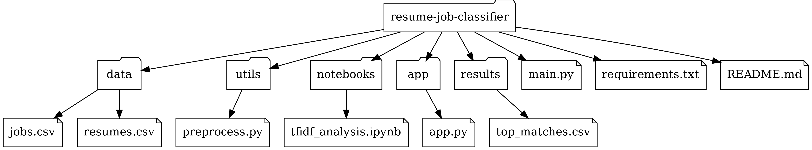

# 📂 Resume-Job Classifier

A machine learning-based system that automatically classifies resumes and recommends relevant job roles. It uses Natural Language Processing (NLP) and a Random Forest classifier to streamline the resume screening process.

---

## 🧠 Features

- 🔍 Resume classification using ML models
- 📊 TF-IDF vectorization for text data
- 🧾 Sample resume support (PDF/TXT)
- 📁 Model and data pipeline included
- 🖼️ Project structure visualized

---
###  Project Structure

```text
resume-job-classifier/
│
├── dataset/                          # Folder containing input data files
│   ├── jobs.csv                      # Dataset with job descriptions
│   └── resumes.csv                   # Dataset with resume texts
│
├── images/                           # Project assets like diagrams or icons
│   └── project_structure_diagram.png # Visual tree of the project structure
│
├── models/                           # Folder for saving ML models (if any)
│
├── templates/                        # HTML templates for web app (Flask/Streamlit)
│
├── utils/                            # Folder for utility and helper scripts
│   └── preprocess.py                 # Script for text cleaning and NLP preprocessing
│
├── app.py                            # Web application script (entry point for GUI)
├── ResumeCatogorization.py           # Core logic for matching resumes to jobs
├── requirements.txt                  # List of Python dependencies
└── README.md                         # Project documentation
```
### Project Structure (Visual)

The overall structure of the project is shown below:


---
## ⚙️ How It Works

1. 📥 Load resume files (PDF or TXT)
2. 🔠 Preprocess with tokenization & TF-IDF
3. 🌲 Apply trained Random Forest classifier
4. 📤 Return top job role predictions

---

## 🛠️ Installation

```bash

git clone https://github.com/Tanscode24/resume-job-classifier.git
cd resume-job-classifier
pip install -r requirements.txt


